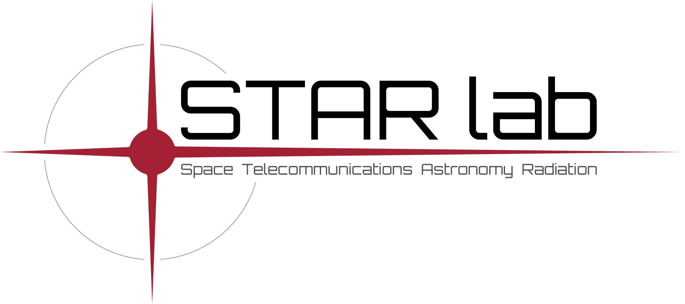

# 🚀 Generalized ADCS
<p>
  
  
</p>
<strong>Generalized ADCS</strong> is a Python framework for satellite attitude determination and control (ADCS), designed for research, prototyping, and flight-software development.

<p align="center"> <a href="/documentation/installation_instructions/INSTALL.md">📘 Installation</a> • <a href="/examples">🧪 Examples</a> • <a href="https://nscheuer.github.io/Generalized_ADCS/">🛠 Documentation</a> • <a href="/documentation/CONTRIBUTING.md">🤝 Contributing</a> </p>

## ✨ Key Features 
<p align="center">
  
</p>

- ✅ Fully generalized 6-DOF RK4 spacecraft dynamics
- ✅ Fully generalized RK4 orbit propagation
- ✅ Estimator support (Orbital, UKF, SRUKF, UAKF, SRUAKF, custom filters)
- ✅ Controller support (PD, LQR, ALTRO, custom controllers)
- ✅ Sensor Modeling
    - Magnetometers
    - Gyroscopes
    - Sun Sensors
    - GPS
- ✅ Actuator Modeling
    - Reaction Wheels
    - Magnetorquers
- ✅ Growing catalogue of CubeSat sensors and actuators

## 📚 Academic Background
This project is based on the PhD research of <strong>Patrick McKeen</strong>:
- 🔗 Source Code: 
[PhD Dissertation Code](https://github.com/patrickmckeen/PhD_Dissertation_Code)
- 📄 Thesis: [*Computational Methods to Improve Satellite Attitude Determination and Control with a Focus on Autonomy, Generalizability, and Underactuation*](https://dspace.mit.edu/handle/1721.1/158874)

## ⚡ Quick Start
```bash
git clone https://github.com/nscheuer/Generalized_ADCS.git
cd Generalized_ADCS
pip install -r requirements.txt
pip install git+https://github.com/jcrudy/choldate.git --no-build-isolation
python examples/cubesat_examples/beavercube1_base_estimator_noisy.py
```
For full installation instructions for your system, including compiling the <u>trajectory planner</u>, see [📘 Installation](/documentation/installation_instructions/INSTALL.md).

🛠 **Sphinx Build Guide:**  
[`documentation/SPHINX.md`](/documentation/SPHINX.md)

⚙️ **Testing Guide:**
['documentation/PYTEST.md'](/documentation/PYTEST.md)

## 📊 Paper Experiments

Generate figures for academic papers using the experiment infrastructure:

```bash
# Quick test (10 trials, 200s) - ~5 min per paper
python testing/paper_todo_tests/experiments/generate_all_paper_figures.py --paper 3p1 --quick

# Full experiments (100 trials, 1000s) - ~2-4 hours per paper
python testing/paper_todo_tests/experiments/generate_all_paper_figures.py --paper 3p1 --full

# All papers (~8-12 hours for full)
python testing/paper_todo_tests/experiments/generate_all_paper_figures.py --all --full
```

Papers covered:
- **3+1 Paper**: Architecture comparison (3+0, 3+1, 3+3), momentum management
- **Generalized Control Paper**: LP vs QP allocation, direction preservation
- **Planner Paper**: ALTRO trajectory planning vs PD baseline
- **Package Paper**: Controller comparison, quickstart demo

See [testing/paper_todo_tests/experiments/README.md](testing/paper_todo_tests/experiments/README.md) for details.
