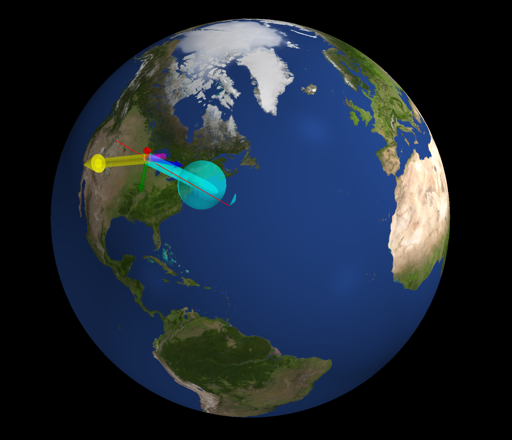

.. Generalized_ADCS documentation master file

Generalized Attitude Determination and Control System
=====================================================

**Generalized ADCS** is a Python library for simulating control and estimation of spacecraft. It is designed to be Python-first, allowing you to interact and modify any component easily with Numpy arrays. 

.. code-block:: python

   import ADCS as ADCS
   import numpy as np
   import matplotlib.pyplot as plt

   acts = [ADCS.RW(axis=np.array([1, 0, 0]), max_torque=0.0023, J=5.7e-6, h=0.0, h_max=0.0036)]
   acts += [ADCS.MTQ(axis, max_torque=0.2) for axis in np.eye(3)]
   sens = [ADCS.MTM(axis) for axis in np.eye(3)]

   satellite = ADCS.Satellite(mass=10, J_0=np.diag([0.03, 0.03, 0.01]), actuators=acts, sensors=sens, boresight=np.array([0, 0, 1]))
   x_0 = np.array([0.01, -0.02, 0.01] + [1, 0, 0, 0] + [0.0])  # w, q, h

   controller = ADCS.controller.MTQ_w_RW_LP(est_sat=satellite, p_gain=0.00005, d_gain=0.002, c_gain=0.001, h_target=np.array([0, 0, 0]))

   goal = ADCS.goals.Coordinate_Goal(lat=42.36, lon=-71.06, alt=0)
   os0 = ADCS.Orbital_State(ephem=ADCS.Ephemeris(),J2000=0.22, R=np.array([5000, 0, 5000]), V=np.array([0, 7.5, 0]))

   results = ADCS.simulate(
      x=x_0,
      satellite=satellite,
      controller=controller,
      goal=goal,
      os0=os0,
      dt=1.0,
      tf=500.0
   )

   ADCS.plot(
      results,
      ADCS.plots.AnimationPlot(goal=goal),
      layout=(1,1),
      title="Underactuated Control Animation",
   )

   ADCS.plot(
      results,
      ADCS.plots.TargetPlot(),
      ADCS.plots.AngularVelocityPlotCombined(sources=["real"]),
      ADCS.plots.ControlPlotCombined(),
      ADCS.plots.ControlPlotSingle(index=0, title="RW Control Torque"),
      layout=(2,2),
      title="Underactuated Control with MTQ and RW",
   )
   plt.show()
   

.. toctree::
   :maxdepth: 1
   :caption: Getting Started

   installation/index
   tutorials/index

.. toctree::
   :maxdepth: 1
   :caption: Function Documentation

   ADCS

Indices and tables
==================

* :ref:`genindex`
* :ref:`modindex`
* :ref:`search`
