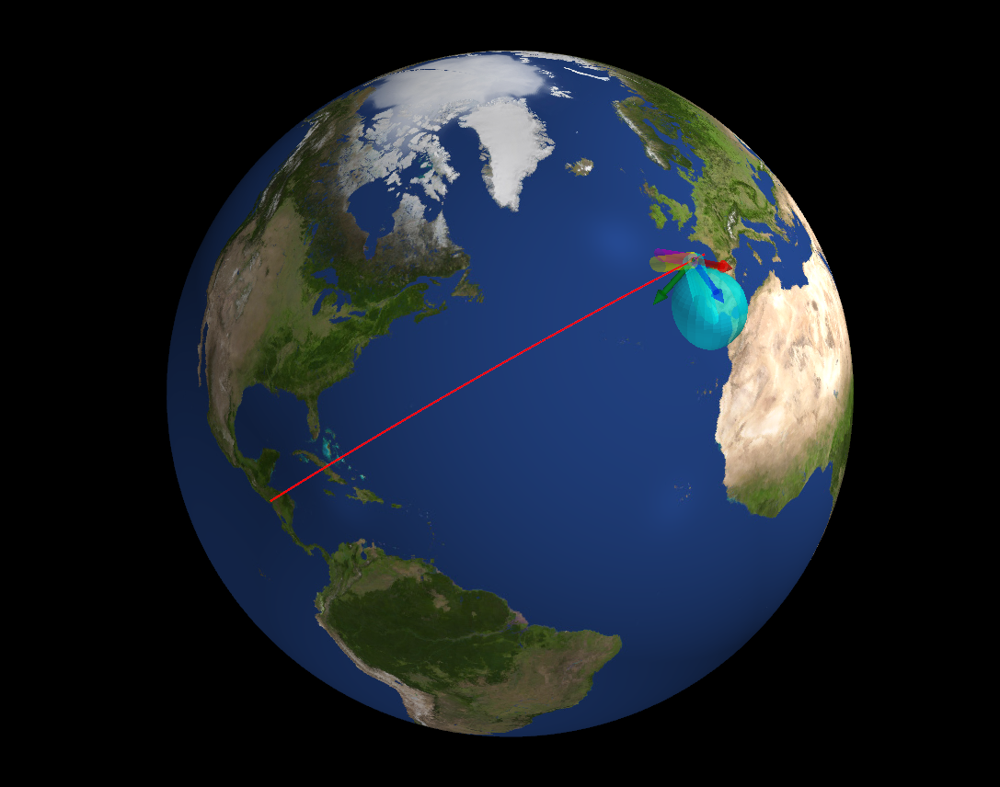

.. Generalized_ADCS documentation master file

Generalized Attitude Determination and Control System
=====================================================

**Generalized ADCS** is a Python library for simulating control and estimation of spacecraft. It is designed to be Python-first, allowing you to interact and modify any component easily with Numpy arrays. 

.. code-block:: python

   import ADCS as ADCS
   
   acts = [RW(axis, max_torque=0.2, J=0.01, h_max=0.1) for axis in np.eye(3)]
   satellite = Satellite(mass=10, J_0=np.diag([1, 1.2, 0.8]), actuators=acts, boresight=np.array([0, 0, 1]))
   # Initial rates (3), quaternion (4), and momentum of reaction wheels
   x_0 = np.array([0.1, 0.1, 0.1] + [1, 0, 0, 0] + [0, 0, 0]) 

   controller = MTQ_w_RW_LP(p_gain=0.001, d_gain=0.01, c_gain=0.01)

   goal = Coordinate_Goal(lat=9, lon=-70, alt=0)
   os0 = Orbital_State(J2000=0.22, R=np.array([7000, 0, 0]), V=np.array([0, 7.5, 1]))

   results = simulate(
         x_0=x_0,
         satellite=satellite,
         controller=controller,
         goal=goal,
         os0=os0,
         dt=1.0,
         tf=3600,
   )

   plot_pyvista(results)
   

We try to make estimators and controllers as general as possible, allowing you to use any sensor or actuator configuration. You can also easily swap different estimation and control algorithms to see how they perform.

.. toctree::
   :maxdepth: 2
   :caption: Contents:

   modules

Indices and tables
==================

* :ref:`genindex`
* :ref:`modindex`
* :ref:`search`
