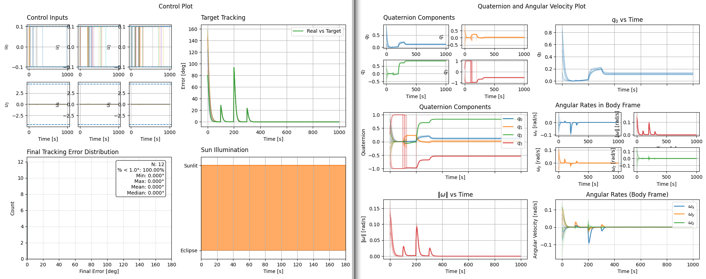
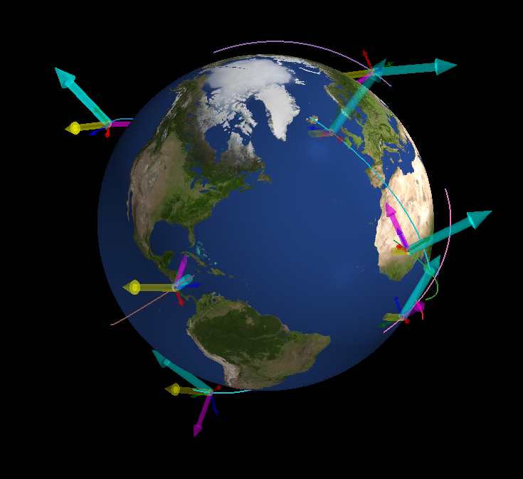
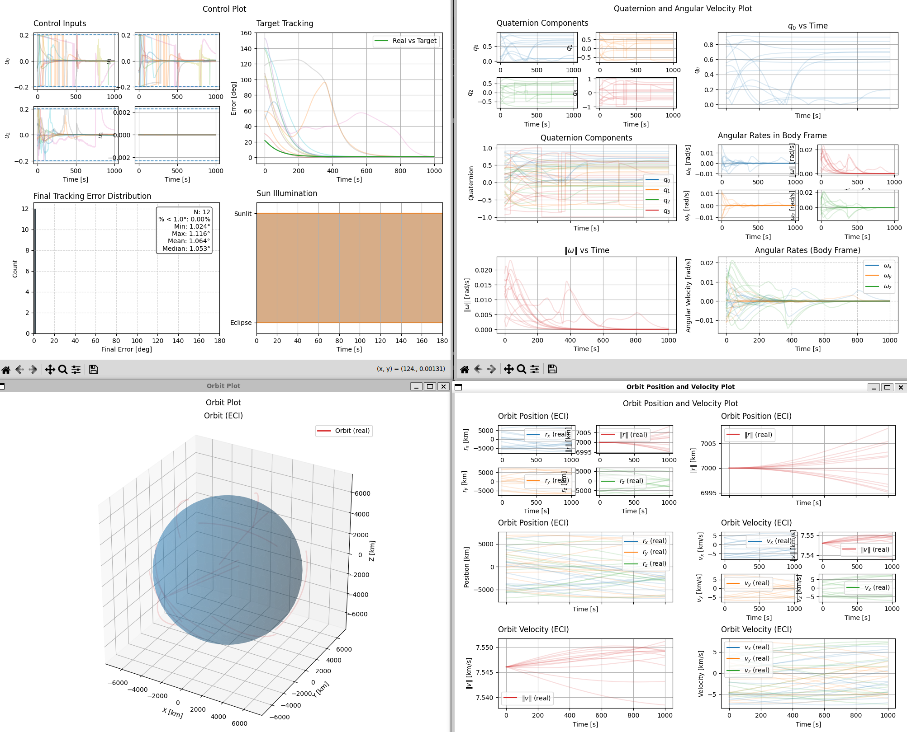

0.0.1 Monte Carlo Simulations (2026-02-02)
=============================================

New Features
------------
- `simulate` framework has been extended to Monte Carlo runs
    - :doc:`simulate_mc <../ADCS.mc.simulate_mc>` function
    - :doc:`MCConfig <../ADCS.mc.mcconfig>` class for specifying Monte Carlo configurations
    - Added saving and loading for :doc:`SimulationResults <../ADCS.helpers.simresults>` to support Monte Carlo runs
- Added support for quaternion goals, now goals are defined as:
    +----------------------+---------------------------------------------+
    | Target row format    | Interpretation                              |
    +======================+=============================================+
    | [nan, tx, ty, tz]    | Direction target expressed in ECI           |
    +----------------------+---------------------------------------------+
    | [q0, q1, q2, q3]     | Desired attitude quaternion (Body to ECI)   |
    +----------------------+---------------------------------------------+
- Added support for goal series with simulate() using :doc:`GoalList <../ADCS.CONOPS.goallist.goallist>`
- Reworked all plotting utilities to be compatible with Monte Carlo results

Example: Multi-Goal Monte Carlo Simulation
------------------------------------------
Consider a predefined orbit and goal sequence, with randomized initial states for a 3 MTQ + 3 RW satellite. 

.. code-block:: python
    
    import ADCS as ADCS
    import numpy as np
    import matplotlib.pyplot as plt

    np.random.seed(42)
    mtm_max_torque = 0.1
    mtqs = [ADCS.MTQ(axis=axes, max_torque=mtm_max_torque) for axes in np.eye(3)]

    rw_max_torque = 4.51
    rw_J = 0.22
    rw_h0 = 1
    rw_hmax = 3.8
    rws = [ADCS.RW(axis=axes, max_torque=rw_max_torque, J=rw_J, h=rw_h0, h_max=rw_hmax) for axes in np.eye(3)]

    acts = mtqs+rws

    mtms = [ADCS.MTM(axis=axes) for axes in np.eye(3)]

    real_sat = ADCS.Satellite(mass=4.0, J_0=np.diagflat([3.4, 2.9, 1.3]), actuators=acts, sensors=mtms, boresight=np.array([0, 0, 1]))
    x_0 = np.array([0, 0, 0] + [1, 0, 0, 0] + [0, 0, 0])

    controller = ADCS.controller.MTQ_w_RW(est_sat=real_sat, p_gain=0.1, d_gain=0.7, c_gain=0.1, h_target=np.array([0, 0, 0]))
    goal_timeline = {0.0: ADCS.goals.Fixed_Attitude_Goal(q_ref=np.array([0, 0, 0, 1])), 100.0: ADCS.goals.Coordinate_Goal(lat=33.75, lon=-84.3885, alt=0), 200.0: ADCS.goals.AntiVelocity_Goal(), 300.0: ADCS.goals.Sun_Goal()}
    goallist = ADCS.GoalList(goal_timeline=goal_timeline, time_units="seconds", start_juliantime=0.22)

    os0 = ADCS.Orbital_State(ephem=ADCS.Ephemeris(),J2000=0.22, R=np.array([7000, 0, 0]), V=np.array([0, 7.5, 0]))

    mc_config = ADCS.MCConfig(
        w = lambda rng: ADCS.helpers.normalize(rng.standard_normal(3)) * (rng.uniform(0.1, 1.0) * np.pi / 180.0),
        q = lambda rng: ADCS.helpers.normalize(rng.standard_normal(4)),
        h = lambda rng: rng.uniform(-1, 1, size=3),
    )

    mc_results = ADCS.simulate_mc(
        x=x_0,
        satellite=real_sat,
        controller=controller,
        goal=goallist,
        os0=os0,
        dt=1.0,
        tf=1000.0,
        mc_config=mc_config,
        num_runs=12,
        base_seed=42,
    )

    ADCS.plot(
        mc_results,
        ADCS.plots.ControlPlot(),
        ADCS.plots.TargetPlot(modes=["real_target"]),
        ADCS.plots.TargetHistogram(),
        ADCS.plots.IlluminationPlot(),
        layout=(2,2),
        title="Control Plot",
    )

    ADCS.plot(
        mc_results,
        ADCS.plots.QuaternionPlot(),
        ADCS.plots.QuaternionPlotSingle(component=0),
        ADCS.plots.QuaternionPlotCombined(),
        ADCS.plots.AngularVelocityPlot(),
        ADCS.plots.AngularVelocityPlotSingle(component="m"),
        ADCS.plots.AngularVelocityPlotCombined(),
        layout=(3,2),
        title="Quaternion and Angular Velocity Plot",
    )

    plt.show()

Example: Vector Goal Monte Carlo Simulation
-------------------------------------------
Consider random circular orbits, initial attitudes, and vector goals for a 3 MTG + 1 RW satellite.

.. code-block:: python
    
    import ADCS as ADCS
    import numpy as np
    import matplotlib.pyplot as plt

    np.random.seed(42)
    mtm_max_torque = 0.1
    mtqs = [ADCS.MTQ(axis=axes, max_torque=mtm_max_torque) for axes in np.eye(3)]

    rw_max_torque = 4.51
    rw_J = 0.22
    rw_h0 = 1
    rw_hmax = 3.8
    rws = [ADCS.RW(axis=axes, max_torque=rw_max_torque, J=rw_J, h=rw_h0, h_max=rw_hmax) for axes in np.eye(3)]

    acts = mtqs+rws

    mtms = [ADCS.MTM(axis=axes) for axes in np.eye(3)]

    real_sat = ADCS.Satellite(mass=4.0, J_0=np.diagflat([3.4, 2.9, 1.3]), actuators=acts, sensors=mtms, boresight=np.array([0, 0, 1]))
    x_0 = np.array([0, 0, 0] + [1, 0, 0, 0] + [0, 0, 0])

    controller = ADCS.controller.MTQ_w_RW(est_sat=real_sat, p_gain=0.1, d_gain=0.7, c_gain=0.1, h_target=np.array([0, 0, 0]))
    goal_timeline = {0.0: ADCS.goals.Fixed_Attitude_Goal(q_ref=np.array([0, 0, 0, 1])), 100.0: ADCS.goals.Coordinate_Goal(lat=33.75, lon=-84.3885, alt=0), 200.0: ADCS.goals.AntiVelocity_Goal(), 300.0: ADCS.goals.Sun_Goal()}
    goallist = ADCS.GoalList(goal_timeline=goal_timeline, time_units="seconds", start_juliantime=0.22)

    os0 = ADCS.Orbital_State(ephem=ADCS.Ephemeris(),J2000=0.22, R=np.array([7000, 0, 0]), V=np.array([0, 7.5, 0]))

    mc_config = ADCS.MCConfig(
        w = lambda rng: ADCS.helpers.normalize(rng.standard_normal(3)) * (rng.uniform(0.1, 1.0) * np.pi / 180.0),
        q = lambda rng: ADCS.helpers.normalize(rng.standard_normal(4)),
        h = lambda rng: rng.uniform(-1, 1, size=3),
    )

    mc_results = ADCS.simulate_mc(
        x=x_0,
        satellite=real_sat,
        controller=controller,
        goal=goallist,
        os0=os0,
        dt=1.0,
        tf=1000.0,
        mc_config=mc_config,
        num_runs=12,
        base_seed=42,
    )

    ADCS.plot(
        mc_results,
        ADCS.plots.ControlPlot(),
        ADCS.plots.TargetPlot(modes=["real_target"]),
        ADCS.plots.TargetHistogram(),
        ADCS.plots.IlluminationPlot(),
        layout=(2,2),
        title="Control Plot",
    )

    ADCS.plot(
        mc_results,
        ADCS.plots.QuaternionPlot(),
        ADCS.plots.QuaternionPlotSingle(component=0),
        ADCS.plots.QuaternionPlotCombined(),
        ADCS.plots.AngularVelocityPlot(),
        ADCS.plots.AngularVelocityPlotSingle(component="m"),
        ADCS.plots.AngularVelocityPlotCombined(),
        layout=(3,2),
        title="Quaternion and Angular Velocity Plot",
    )

    plt.show()

