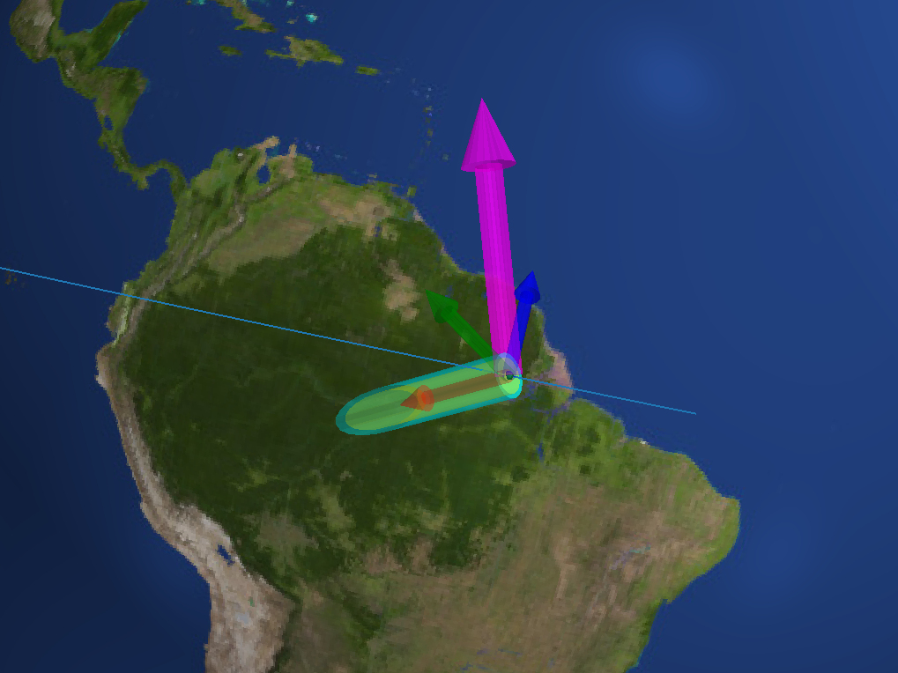
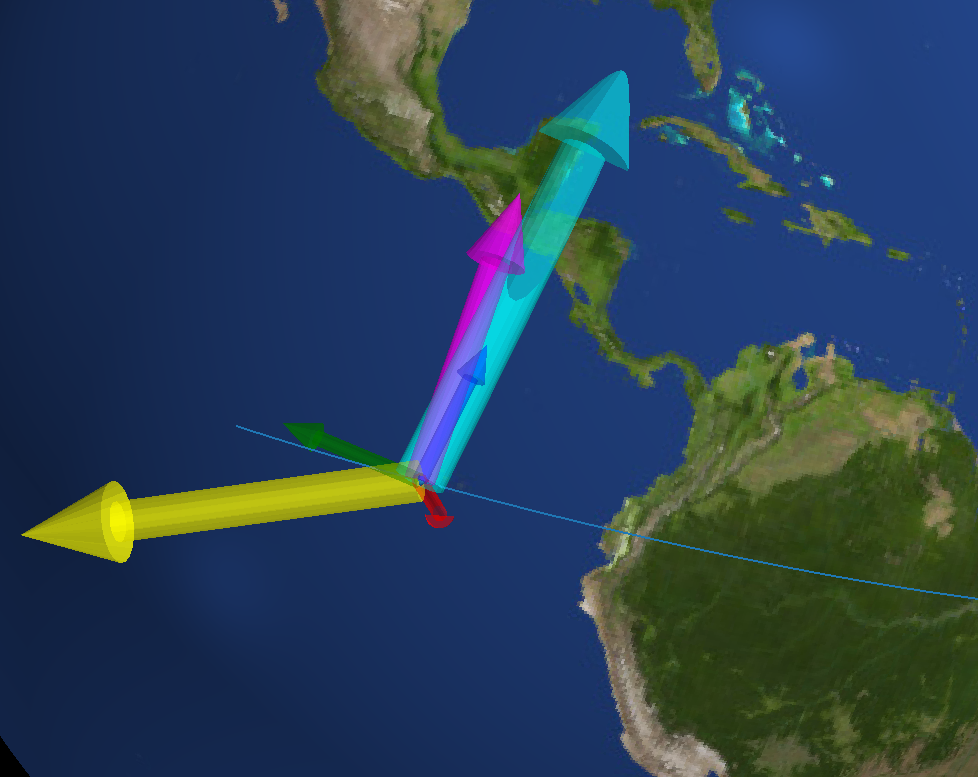
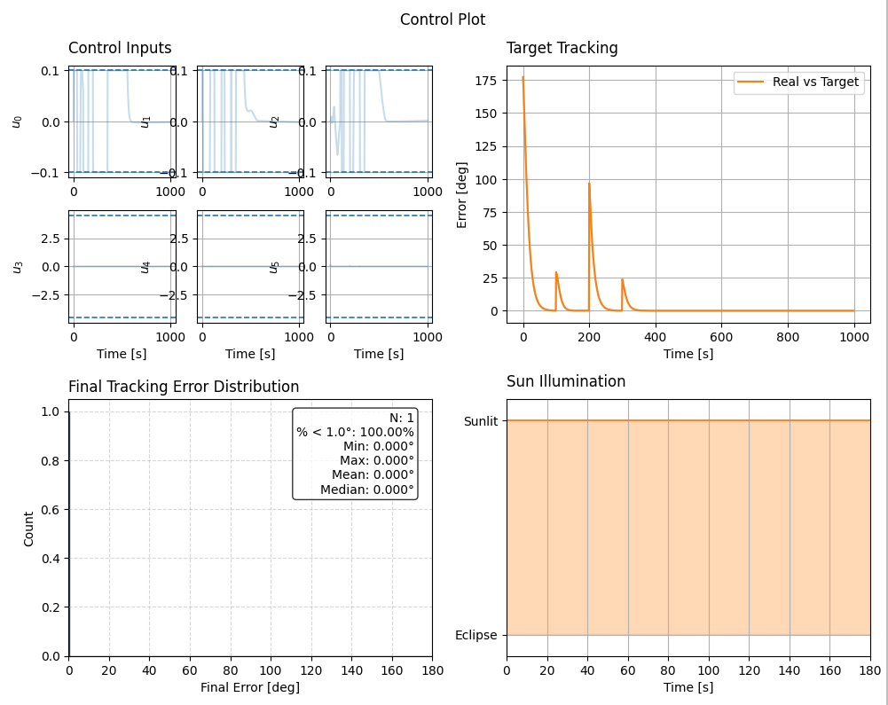

0.0.2 Multi-Boresight (2026-02-23)
==============================================

New Features
------------
- **Multi-Boresight Support**: Satellites can now define multiple named boresights for different payloads and instruments
    - Boresight argument now accepts a dictionary mapping names to 3D vectors
    - Goals can reference specific boresights via the ``boresight_name`` parameter
    - Fully backward compatible with single boresights (``np.ndarray``)
- **Backward Compatibility**
    - Passing ``np.ndarray`` as a boresight: automatically registered as ``"default"``
    - Passing ``None``: defaults to ``(0, 0, 1)`` and registered as ``"default"``
- Added ``boresight_hist`` field to simulation results in both :doc:`simulate <../ADCS.simulate>` and :doc:`simulate_mc <../ADCS.mc.simulate_mc>`

Example: Multi-Boresight Single-Run Simulation
-----------------------------------------------
Consider a satellite with multiple instruments pointing in different directions, using a fixed-attitude goal followed by goals that reference specific boresights.

.. code-block:: python
    
    import ADCS as ADCS
    import numpy as np
    import matplotlib.pyplot as plt

    np.random.seed(42)
    mtm_max_torque = 0.1
    mtqs = [ADCS.MTQ(axis=axes, max_torque=mtm_max_torque) for axes in np.eye(3)]

    rw_max_torque = 4.51
    rw_J = 0.22
    rw_h0 = 1
    rw_hmax = 3.8
    rws = [ADCS.RW(axis=axes, max_torque=rw_max_torque, J=rw_J, h=rw_h0, h_max=rw_hmax) for axes in np.eye(3)]

    acts = mtqs + rws
    mtms = [ADCS.MTM(axis=axes) for axes in np.eye(3)]

    # Define multiple boresights for different instruments
    boresights = {
        "camera": np.array([0, 0, 1]),
        "solar_panel": np.array([1, 0, 0])
    }

    real_sat = ADCS.Satellite(
        mass=4.0,
        J_0=np.diagflat([3.4, 2.9, 1.3]),
        actuators=acts,
        sensors=mtms,
        boresight=boresights
    )
    x_0 = np.array([0, 0, 0] + [1, 0, 0, 0] + [0, 0, 0])

    controller = ADCS.controller.MTQ_w_RW(
        est_sat=real_sat,
        p_gain=0.1,
        d_gain=0.7,
        c_gain=0.1,
        h_target=np.array([0, 0, 0])
    )

    # Define goals that reference specific boresights
    goal_timeline = {
        0.0: ADCS.goals.Fixed_Attitude_Goal(q_ref=np.array([0, 0, 0, 1])),
        100.0: ADCS.goals.Coordinate_Goal(lat=33.75, lon=-84.3885, alt=0, boresight_name="camera"),
        200.0: ADCS.goals.AntiVelocity_Goal(boresight_name="solar_panel"),
        300.0: ADCS.goals.Sun_Goal(boresight_name="solar_panel")
    }
    goallist = ADCS.GoalList(
        goal_timeline=goal_timeline,
        time_units="seconds",
        start_juliantime=0.22
    )

    os0 = ADCS.Orbital_State(
        ephem=ADCS.Ephemeris(),
        J2000=0.22,
        R=np.array([7000, 0, 0]),
        V=np.array([0, 7.5, 0])
    )

    results = ADCS.simulate(
        x=x_0,
        satellite=real_sat,
        controller=controller,
        goal=goallist,
        os0=os0,
        dt=1.0,
        tf=1000.0
    )

    ADCS.plot(
        results,
        ADCS.plots.ControlPlot(),
        ADCS.plots.TargetPlot(modes=["real_target"]),
        ADCS.plots.TargetHistogram(),
        ADCS.plots.IlluminationPlot(),
        layout=(2, 2),
        title="Control Plot",
    )

    plt.show()

As can be seen in the plots, the satellite successfully aligns with the camera boresight during the coordinate goal and then reorients to align the solar panel boresight for the anti-velocity and sun goals, demonstrating the multi-boresight functionality in action.

Backward Compatibility
----------------------
The multi-boresight feature is fully backward compatible:

**Single boresight as ``np.ndarray``:**

.. code-block:: python

    real_sat = ADCS.Satellite(
        mass=4.0,
        J_0=np.diagflat([3.4, 2.9, 1.3]),
        actuators=acts,
        sensors=mtms,
        boresight=np.array([0, 0, 1])  # Automatically named "default"
    )

**No boresight specified:**

.. code-block:: python

    real_sat = ADCS.Satellite(
        mass=4.0,
        J_0=np.diagflat([3.4, 2.9, 1.3]),
        actuators=acts,
        sensors=mtms
        # boresight defaults to (0, 0, 1) as "default"
    )

Both forms register the boresight as ``"default"``, allowing goals to use ``boresight_name="default"`` or rely on the default behavior when no boresight name is specified.
