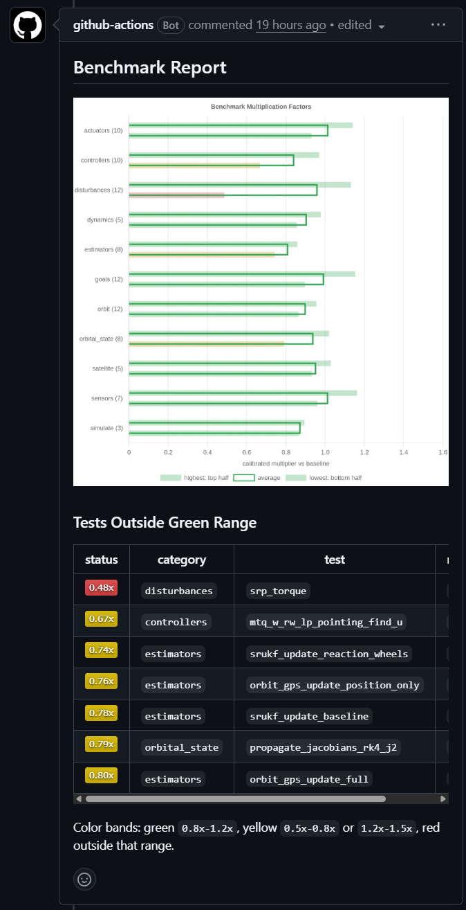

0.1.6 Benchmark (2026-07-17)
============================

New performance benchmarks were added to track runtime regressions automatically. Each pull request targeting ``main`` runs the benchmark suite, compares the new measurements against the baseline, and flags unexpected slowdowns before merge.

