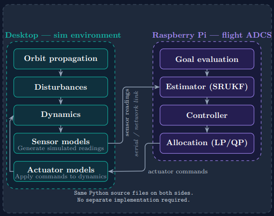
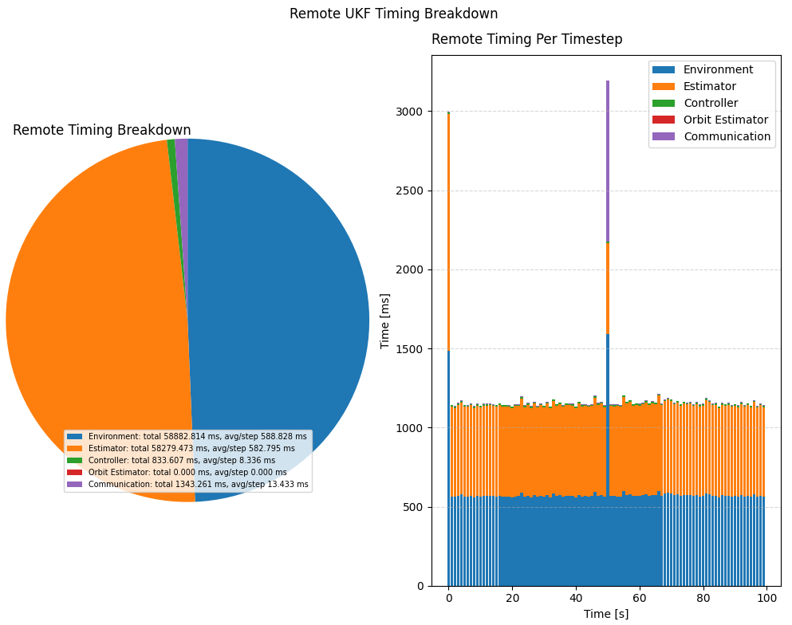

0.1.6 Remote Execution (2026-07-17)
===================================

Remote execution lets the main PC keep the simulation truth model local while selected ADCS components, such as the controller or estimators, run on a Raspberry Pi over XML-RPC. This mirrors the Tutorial 8 setup and makes it easy to check distributed workflows before moving to hardware-in-the-loop style testing.

See also :doc:`Tutorial 8: Remote Execution <../tutorials/08_remote_execution>` for the full setup walkthrough and :doc:`API documentation <../ADCS>` for the underlying interfaces.

An abbreviated example from the tutorial is shown below:

.. code-block:: python

   remote_host = os.getenv("ADCS_REMOTE_HOST", "127.0.0.1")
   remote_port = int(os.getenv("ADCS_REMOTE_PORT", "5000"))

   results = ADCS.simulate_remote(
       x=x_0,
       satellite=real_sat,
       os0=os0,
       controller=controller,
       goal=goal,
       dt=1.0,
       tf=1000.0,
       remote=ADCS.remote.RemoteSimulationConfig(
           controller=ADCS.remote.ComponentLocation.REMOTE,
           estimator=ADCS.remote.ComponentLocation.LOCAL,
           orbit_estimator=ADCS.remote.ComponentLocation.LOCAL,
           host=remote_host,
           port=remote_port,
           timeout_s=0.5,
           retries=2,
       ),
   )
