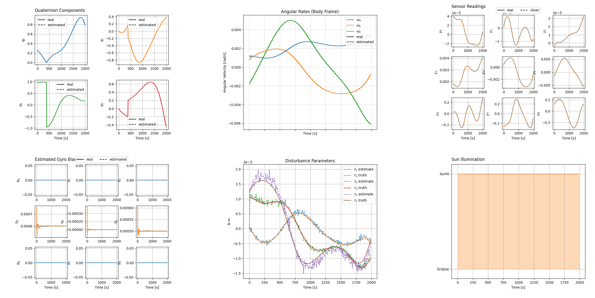

2.0 New Estimation Framework
============================

Release 2.0 introduces a new, composable foundation for spacecraft attitude
estimation. The new APIs make state layouts, uncertainty representations,
measurements, and process models explicit while keeping the estimator
implementations interchangeable.

State class
-----------

The new :class:`~ADCS.state.State` class represents the physical spacecraft
state with named ``w`` (angular velocity), ``q`` (attitude quaternion), and
``h`` (reaction-wheel momentum) fields. It provides explicit conversions
between full and local/tangent coordinates, quaternion retraction and state
differences, validation, copying, and support for configurable attitude
charts. :class:`~ADCS.state.EstimatorState` extends it with estimated bias and
disturbance-parameter blocks and their covariance data.

Covariance class
----------------

The new :class:`~ADCS.covariance.Covariance` class provides a common interface
for full covariance matrices and upper-triangular square-root factors. It
handles positive-semidefinite validation, conversion between representations,
coordinate labels, and the matrix operations used by both covariance-form
and square-root filters.

Measurement stack
-----------------

The new
:class:`~ADCS.estimators.measurement_stack.MeasurementStack` assembles sensor
and reaction-wheel measurements into one canonical estimator vector. It owns
source ordering, availability and scheduling masks, residual coordinates,
covariances, and measurement Jacobians. Quaternion measurements are reduced
to their three-dimensional local residual, and augmented estimators can
consistently include sensor-bias terms.

Process model and process noise
-------------------------------

The new estimator process model centralizes deterministic state propagation in
:func:`~ADCS.estimators.process_model.propagate_state`. The process-noise
utilities assemble continuous-time noise from unmodeled dynamics and
configured hardware random walks, construct the local error-state model, and
discretize it with the Van Loan method; held actuator-command noise is handled
separately. UKF/SRUKF propagate it through control sigma points, while
linearized filters include it in the discrete process covariance.
This keeps the physical model independent of the filter.

New ``AttitudeEstimator`` base
------------------------------

The new :class:`~ADCS.estimators.attitude_estimators.attitude_estimator.AttitudeEstimator`
base class defines the shared estimator lifecycle: state validation,
prediction, measurement updates, diagnostics, covariance handling, and
quaternion-chart conventions. The legacy ``Attitude_Estimator``, ``UAKF`` and
``SRUAKF`` are gone; their callers move to ``AttitudeEstimator``, ``UKF`` and
``SRUKF``, whose constructors take the estimated satellite, the initial
:class:`~ADCS.state.EstimatorState` and ``dt``.

Eight new attitude estimators
-----------------------------

The following estimators are available from the top-level ``ADCS`` package:

* :class:`~ADCS.estimators.attitude_estimators.attitude_EKF.EKF` — additive
  Extended Kalman Filter.
* :class:`~ADCS.estimators.attitude_estimators.attitude_MEKF.MEKF` —
  multiplicative Extended Kalman Filter with a local attitude error.
* :class:`~ADCS.estimators.attitude_estimators.attitude_UKF.UKF` — Unscented
  Kalman Filter.
* :class:`~ADCS.estimators.attitude_estimators.attitude_SRUKF.SRUKF` — square-
  root Unscented Kalman Filter.
* :class:`~ADCS.estimators.attitude_estimators.attitude_AugmentedEKF.AugmentedEKF`
  — EKF with joint bias and disturbance-parameter estimation.
* :class:`~ADCS.estimators.attitude_estimators.attitude_AugmentedMEKF.AugmentedMEKF`
  — augmented multiplicative EKF.
* :class:`~ADCS.estimators.attitude_estimators.attitude_AugmentedUKF.AugmentedUKF`
  — augmented UKF.
* :class:`~ADCS.estimators.attitude_estimators.attitude_AugmentedSRUKF.AugmentedSRUKF`
  — augmented square-root UKF.

Documentation and examples
--------------------------

The estimation tutorials and runnable estimator examples are linked directly
from the release documentation:

* :doc:`Tutorial 3: Simple estimation <../tutorials/03_simple_estimation>`
  — `Tutorial 3 augmented source script <https://github.com/nscheuer/Generalized_ADCS/blob/main/examples/tutorials/tutorial_3_simple_estimation_augmented.py>`_.
* :doc:`Tutorial 4: Complex estimation <../tutorials/04_complex_estimation>`
  — `Tutorial 4 augmented source script <https://github.com/nscheuer/Generalized_ADCS/blob/main/examples/tutorials/tutorial_4_complex_estimation_augmented.py>`_.

Regular estimator examples:

* `EKF example <https://github.com/nscheuer/Generalized_ADCS/blob/main/examples/estimators/example_ekf.py>`_.
* `MEKF example <https://github.com/nscheuer/Generalized_ADCS/blob/main/examples/estimators/example_mekf.py>`_.
* `UKF example <https://github.com/nscheuer/Generalized_ADCS/blob/main/examples/estimators/example_ukf.py>`_.
* `SRUKF example <https://github.com/nscheuer/Generalized_ADCS/blob/main/examples/estimators/example_srukf.py>`_.

Advanced estimator examples:

* `Advanced EKF example <https://github.com/nscheuer/Generalized_ADCS/blob/main/examples/estimators/example_advanced_EKF.py>`_.
* `Advanced MEKF example <https://github.com/nscheuer/Generalized_ADCS/blob/main/examples/estimators/example_advanced_MEKF.py>`_.
* `Advanced UKF example <https://github.com/nscheuer/Generalized_ADCS/blob/main/examples/estimators/example_advanced_UKF.py>`_.
* `Advanced SRUKF example <https://github.com/nscheuer/Generalized_ADCS/blob/main/examples/estimators/example_advanced_SRUKF.py>`_.

* `Estimator examples folder <https://github.com/nscheuer/Generalized_ADCS/tree/main/examples/estimators>`_.
* `Debug scripts folder <https://github.com/nscheuer/Generalized_ADCS/tree/main/debug>`_.
