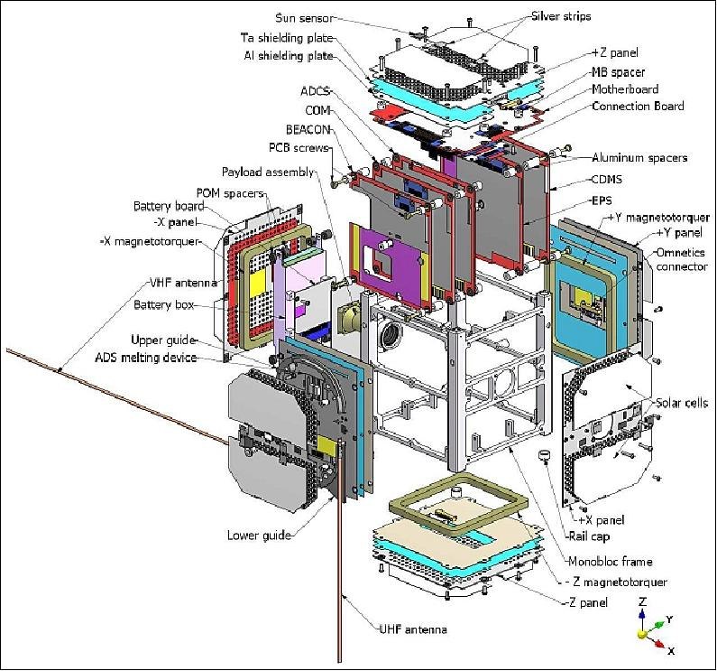

02: Noisy Control
=================

We consider the SwissCube CubeSat launched by the `EPFL Space Center <https://espace.epfl.ch/research/past-projects/swisscube-project/>`_ in 2009 and still in operation.

SwissCube is a small 1U CubeSat with a simple actuator layout of 3 magnetorquers (MTQs). We will simulate detumbling the CubeSat from an initial angular velocity in the presence of sensor and actuator noise.

.. list-table:: Simulation Configuration
   :widths: 25 75
   :header-rows: 1

   * - Component
     - Description
   * - **Actuators**
     - Set of 3 Magnetorquers (MTQ), with maximum strength 0.1 Am² and noise standard deviation of 0.005 Am².
   * - **Sensors**
     - Set of 3 Magnetometers (MTM), with noise standard deviation of 1e-7 T.
   * - **Satellite**
     - Mass of 1.2 kg, Inertia Matrix :math:`J_0 = diag([0.01, 0.012, 0.015]) kg \cdot m^{2}`.
   * - **Initial State**
     - The starting attitude state vector consisting of angular velocity, quaternion orientation, and RW momentum: :math:`[\boldsymbol{\omega}, \mathbf{q}, \mathbf{h}]`.
   * - **Controller**
     - BDot detumbling controller with gain :math:`5 \times 10^{4}`.
   * - **Orbital State**
     - The initial position and velocity of the spacecraft in orbit.

.. code-block:: python
    
    import ADCS as ADCS
    import numpy as np
    import matplotlib.pyplot as plt

    acts_noise = ADCS.Noise(std_noise=0.005)
    acts = [ADCS.MTQ(axis, max_torque=0.1, noise=acts_noise) for axis in np.eye(3)]
    sens_noise = ADCS.Noise(std_noise=1e-7)
    sens = [ADCS.MTM(axis, noise=sens_noise) for axis in np.eye(3)]

    satellite = ADCS.Satellite(mass=10, J_0=np.diag([0.003, 0.003, 0.003]), actuators=acts, sensors=sens)
    x_0 = ADCS.State.from_array(np.array([0.01, 0.05, 0] + [1, 0, 0, 0])) # w, q

    controller = ADCS.controller.BDot(est_sat=satellite, gain=5e4)

    os0 = ADCS.Orbital_State(ephem=ADCS.Ephemeris(),J2000=0.22, R=np.array([5000, 0, 5000]), V=np.array([0, 7.5, 0]))

    results = ADCS.simulate(
        x=x_0,
        satellite=satellite,
        controller=controller,
        os0=os0,
        dt=10.0,
        tf=5000.0
    )

    ADCS.plot(
        results,
        ADCS.plots.AttitudePlot(sources=["real"]),
        layout=(1,1),
        title="B-Dot Magnetic Detumbling Control",
    )

    ADCS.plot(
        results,
        ADCS.plots.AngularVelocityPlotCombined(sources=["real"]),
        ADCS.plots.ControlPlotCombined(title="Magnetorquer Commands", units="Am²"),
        ADCS.plots.SensorsPlotCombined(title="Magnetometer Readings", sources=["clean"], units="T"),
        ADCS.plots.SensorsPlotCombined(title="Magnetometer Readings (Noisy)", sources=["real"], units="T"),
        layout=(2,2),
        title="B-Dot Magnetic Detumbling Control",
    )
    plt.show()

.. list-table::
   :widths: 50 50
   :header-rows: 0
   :class: borderless

   * - .. image:: ../_static/tutorials/tutorial_02_attitudeplot.png
          :width: 100%
     - .. image:: ../_static/tutorials/tutorial_02_plots.png
          :width: 100%