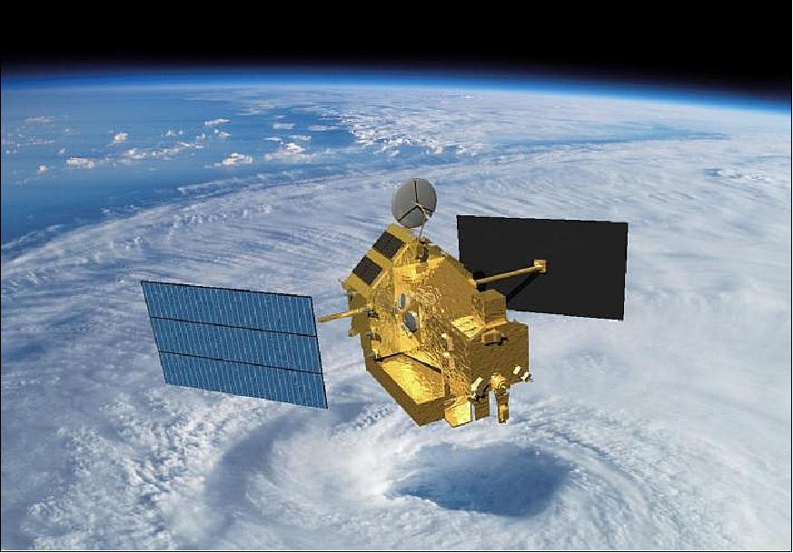

03: Simple Estimation
=====================

All previous examples assumed perfect state knowledge of the satellite. The package provides different estimators to use with various sensors and configurations.

Consider the TRMM (Tropical Rainfall Measuring Mission) satellite, launched by NASA and JAXA in 1997. We will model the satellite with some of its sensors and try to build a simple estimator around it. 

.. list-table:: Simulation Configuration
   :widths: 25 75
   :header-rows: 1

   * - Component
     - Description
   * - **Sensors**
     - 
       - Set of 3 Gyroscopes (Gyro), with noise standard deviation of 0.31623e-7 :math:`\mu rad/s^{0.5}`.
       - Set of 3 Magnetometers (MTM), with a noise standard deviation of 50 :math:`nT/s^{0.5}`.
       - Set of 3 Sun Sensors (SunPair), with a noise standard deviation of 2e-3 (unitless) and efficiency of 0.3.
   * - **Satellite**
     - Mass of 3000 kg, Inertia Matrix :math:`J_0 = diag([500, 1500, 1500]) \, kg \cdot m^{2}`.
   * - **Initial State**
     - The real initial state is set to an angular velocity of  
       :math:`[0.001, 0.001, -0.002] \, rad/s`  
       and an attitude represented by quaternion  
       :math:`[0.2588, 0, 0.9659, 0]`.
   * - **Estimated Sensors**
     - 
       - Set of 3 Gyroscopes (Gyro), with noise standard deviation of 5e-7 :math:`\mu rad/s^{0.5}`.
       - Set of 3 Magnetometers (MTM), with a noise standard deviation of 50 :math:`nT/s^{0.5}`.
       - Set of 3 Sun Sensors (SunPair), with a noise standard deviation of 1e-3 (unitless) and efficiency of 0.3.
   * - **Estimated Satellite**
     - Mass of 3200 kg, Inertia Matrix  
       :math:`J_0 = diag([450, 1400, 1400]) \, kg \cdot m^{2}`.
   * - **Estimated Initial State**
     - The estimated initial state is set to an angular velocity of  
       :math:`[0, 0, 0] \, rad/s`  
       and an attitude represented by quaternion  
       :math:`[1, 0, 0, 0]`.
   * - **Estimator**
     - :class:`~ADCS.AugmentedSRUKF` (augmented Square Root Unscented Kalman Filter) with tuned initial covariance and process noise matrices.
   * - **Orbital State**
     - The initial position and velocity of the spacecraft in orbit.
   * - **Disturbances**
     - Include Gravity Gradient disturbance torque on both the real and estimated satellite models.

.. code-block:: python

  import os
  import sys
  sys.path.append(os.path.abspath(os.path.join(__file__, "../../..")))
  import ADCS as ADCS
  import numpy as np
  from scipy.linalg import block_diag
  import matplotlib.pyplot as plt

  dt = 20.0

  # Real Satellite
  gyro_noise = ADCS.Noise(std_noise=3.1623e-7)
  sens = [ADCS.Gyro(axis, noise=gyro_noise) for axis in np.eye(3)]

  mtm_noise = ADCS.Noise(std_noise=5e-8)
  sens += [ADCS.MTM(axis, noise=mtm_noise) for axis in np.eye(3)]

  sun_noise = ADCS.Noise(std_noise=2e-3)
  sens += [ADCS.SunPair(axis, efficiency=0.3,noise=sun_noise) for axis in np.eye(3)]

  gg_dist = [ADCS.disturbances.GG_Disturbance()]
  satellite = ADCS.Satellite(mass=3000, J_0=np.diag([500, 1500, 1500]), sensors=sens, disturbances=gg_dist)
  x_0 = ADCS.State.from_array(np.array([0.001, 0.001, -0.002] + [0.2588, 0, 0.9659, 0])) # w, q

  # Estimated Satellite
  est_gyro_noise = ADCS.Noise(std_noise=5e-7)
  est_sens = [ADCS.Gyro(axis, noise=est_gyro_noise) for axis in np.eye(3)]

  est_mtm_noise = ADCS.Noise(std_noise=5e-8)
  est_sens += [ADCS.MTM(axis, noise=est_mtm_noise) for axis in np.eye(3)]

  est_sun_noise = ADCS.Noise(std_noise=1e-3)
  est_sens += [ADCS.SunPair(axis, efficiency=0.3, noise=est_sun_noise) for axis in np.eye(3)]

  est_gg_dist = [ADCS.disturbances.GG_Disturbance()]
  est_satellite = ADCS.EstimatedSatellite(mass=3200, J_0=np.diag([450, 1400, 1400]), sensors=est_sens, disturbances=est_gg_dist)
  x_hat = ADCS.EstimatorState(w=np.zeros(3), q=[1, 0, 0, 0]) # w, q

  # Estimator
  P_hat = block_diag(
      np.eye(3)*(0.01)**2, # Angular Velocity Initial State Error
      np.eye(3), # Attitude (MRP) Initial State Error
      )
  Q_hat = block_diag(
      np.eye(3)*(1e-8)**2.0, 
      1e-8*np.eye(3)
  )
  x_hat = ADCS.EstimatorState(w=x_hat.w, q=x_hat.q, cov=P_hat, int_cov=Q_hat)
  estimator = ADCS.AugmentedSRUKF(
      est_satellite, x_hat, dt=dt,
  )

  os0 = ADCS.Orbital_State(ephem=ADCS.Ephemeris(), J2000=0.22, R=np.array([5000, 0, 5000]), V=np.array([0, -7.5, 0]))

  results = ADCS.simulate(
      x=x_0,
      satellite=satellite,
      est_satellite=est_satellite,
      estimator=estimator,
      os0=os0,
      dt=dt,
      tf=5000.0
  )

  ADCS.plot(
      results,
      ADCS.plots.AttitudePlot(sources=["real", "estimated"]),
      layout=(1,1),
      title="Estimator Convergence",
  )

  ADCS.plot(
      results,
      ADCS.plots.AngularVelocityPlotCombined(sources=["real", "estimated"]),
      ADCS.plots.TargetPlot(modes=["real_est"]),
      ADCS.plots.SensorsPlot(title="All Sensor Readings", sources=["real", "clean"]),
      ADCS.plots.IlluminationPlot(),
      layout=(2,2),
      title="Estimator Convergence",
  )
  plt.show()

Note that in the configuration, we may not have perfect knowledge of the satellite's mass and inertia properties, as well as the sensor characteristics. The estimator is able to converge to the true state over time despite these uncertainties, as shown in the plots below.

.. list-table::
   :widths: 50 50
   :header-rows: 0
   :class: borderless

   * - .. image:: ../_static/tutorials/tutorial_03_attitudeplot.png
          :width: 100%
     - .. image:: ../_static/tutorials/tutorial_03_plots.png
          :width: 100%

Starting from the first readings
--------------------------------

The estimator above starts at the identity attitude with a large covariance and
needs a while to converge. That start is a guess, and the filters are not built
for guesses: an EKF, MEKF or UKF corrects an attitude it already has, with
corrections linearised about that estimate, so a start that is far from the
truth converges slowly and, with a poor covariance, can settle on a wrong
solution or diverge. The readings themselves offer a better start. When the
satellite carries sensors that see two or more different directions (here the
magnetometers and the sun pairs), the first measurement vector already
determines the attitude: each measured direction is also known in the inertial
frame, and two non-parallel ones pin down the rotation between the frames. The
module :mod:`ADCS.estimators.attitude_determination` solves this "single-frame"
problem with the classic TRIAD and QUEST algorithms (and explains them, with the
original papers); the result is accurate to the sensors' noise and comes with a
covariance, so the filter starts where its linearisation holds and its first
covariance is honest rather than a large placeholder.

Pass a :class:`~ADCS.estimators.initialization.WarmStart` in place of the
initial state and the estimator builds its own state on its first cycle:

.. code-block:: python

  estimator = ADCS.AugmentedSRUKF(
      est_satellite, ADCS.WarmStart(process_noise=Q_hat), dt=dt,
  )

The attitude is solved from the direction observations with QUEST (or TRIAD, or
taken from a quaternion star tracker when there is one), the angular rate is
read off the gyros assuming zero bias, and the wheel momenta off the wheels. The
covariance follows from the sensors' noise. Biases and disturbance parameters
start at zero; when the satellite estimates them, give their initial standard
deviations (``act_bias_std``, ``sens_bias_std``, ``dist_param_std``). Any value
can be supplied instead of read, together with its standard deviation (for
example ``rate=np.zeros(3), rate_std=0.01`` for a satellite without gyros).
The estimator has no state before its first cycle; afterwards
``estimator.warm_start_attitude`` holds the attitude solution it started from.
In eclipse the sun sensors give no direction, so with only magnetometers and sun
sensors the first readings must be taken in sunlight, otherwise the estimator
raises and asks for an explicit initial attitude.

To build the state yourself, call
:func:`~ADCS.estimators.initialization.initial_state_from_readings` with the
satellite, one measurement vector and its orbital state, or use the
``from_readings`` class method of any estimator, which constructs the filter
and runs that first cycle in one call.
