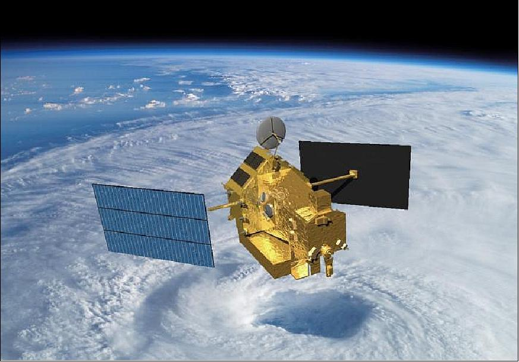

04: Complex Estimation
======================

We again consider the TRMM (Tropical Rainfall Measuring Mission) satellite, launched by NASA and JAXA in 1997. 

This time, sensors will have biases that must be actively estimated and accounted for. 

.. list-table:: Simulation Configuration
   :widths: 25 75
   :header-rows: 1

   * - Component
     - Description
   * - **Sensors**
     - 
       - Set of 3 Gyroscopes (Gyro), with noise standard deviation of 0.31623e-7 :math:`\mu rad/s^{0.5}`, initial bias of 0.1 :math:`\mu rad/s`, and bias random walk standard deviation of 3.1623e-10 :math:`\mu rad/s^{1.5}`.
       - Set of 3 Magnetometers (MTM), with a noise standard deviation of 50 :math:`nT/s^{0.5}`, initial biases of approximately -1e-9 T, and bias random walk standard deviation of 1e-9 T/sqrt(s).
       - Set of 3 Sun Sensors (SunPair), with a noise standard deviation of 2e-3 (unitless) and efficiency of 0.3, initial biases of approximately 0.02 (unitless), and bias random walk standard deviation of 0.0003 (unitless)/sqrt(s).
   * - **Satellite**
     - Mass of 3000 kg, Inertia Matrix :math:`J_0 = diag([500, 1500, 1500]) \, kg \cdot m^{2}`.
   * - **Initial State**
     - The real initial state is set to an angular velocity of  
       :math:`[0.001, 0.001, -0.002] \, rad/s`  
       and an attitude represented by quaternion  
       :math:`[0.2588, 0, 0.9659, 0]`.
   * - **Estimated Sensors**
     - 
       - Set of 3 Gyroscopes (Gyro), with noise standard deviation of 5e-7 :math:`\mu rad/s^{0.5}`, zero initial bias, and bias random walk standard deviation of 1e-10 :math:`\mu rad/s^{1.5}`.
       - Set of 3 Magnetometers (MTM), with a noise standard deviation of 50 :math:`nT/s^{0.5}`, zero initial bias, and bias random walk standard deviation of 1e-9 T/sqrt(s).
       - Set of 3 Sun Sensors (SunPair), with a noise standard deviation of 1e-3 (unitless) and efficiency of 0.3, zero initial bias, and bias random walk standard deviation of 0.0001 (unitless)/sqrt(s).
   * - **Estimated Satellite**
     - Mass of 3200 kg, Inertia Matrix  
       :math:`J_0 = diag([450, 1400, 1400]) \, kg \cdot m^{2}`.
   * - **Estimated Initial State**
     - The estimated initial state is set to an angular velocity of  
       :math:`[0, 0, 0] \, rad/s`  
       and an attitude represented by quaternion  
       :math:`[1, 0, 0, 0]`.
   * - **Estimator**
     - SRUAKF (Square Root Unscented Kalman Filter) with tuned initial covariance and process noise matrices.
   * - **Orbital State**
     - The initial position and velocity of the spacecraft in orbit.
   * - **Disturbances**
     - Include Gravity Gradient disturbance torque on both the real and estimated satellite models.

.. code-block:: python

    import ADCS as ADCS
    import numpy as np
    from scipy.linalg import block_diag
    import matplotlib.pyplot as plt

    dt = 20.0

    # Real Satellite
    gyro_noise = ADCS.Noise(std_noise=3.1623e-7)
    gyro_bias = ADCS.Bias(bias=0.1,std_bias=3.1623e-10)
    sens = [ADCS.Gyro(axis, noise=gyro_noise, bias=gyro_bias) for axis in np.eye(3)]

    mtm_noise = ADCS.Noise(std_noise=50e-9)
    mtm_initial_bias = np.array([-0.9948e-9, -0.0199e-9, -0.0995e-9])
    for axis, initial_bias in zip(np.eye(3), mtm_initial_bias):
        mtm_bias = ADCS.Bias(bias=initial_bias, std_bias=1e-9)
        sens += [ADCS.MTM(axis, noise=mtm_noise, bias=mtm_bias)]

    sun_noise = ADCS.Noise(std_noise=2e-3)
    sun_initial_bias = np.array([0.015, 0.027, -0.009])
    for axis, initial_bias in zip(np.eye(3), sun_initial_bias):
        sun_bias = ADCS.Bias(bias=initial_bias, std_bias=0.0003)
        sens += [ADCS.SunPair(axis, efficiency=0.3,noise=sun_noise, bias=sun_bias)]

    gg_dist = [ADCS.disturbances.GG_Disturbance()]
    satellite = ADCS.Satellite(mass=3000, J_0=np.diag([500, 1500, 1500]), sensors=sens, disturbances=gg_dist)
    x_0 = ADCS.State.from_array(np.array([0.001, 0.001, -0.002] + [0.2588, 0, 0.9659, 0])) # w, q

    # Estimated Satellite
    est_gyro_noise = ADCS.Noise(std_noise=3.1623e-7)
    est_gyro_bias = ADCS.Bias(bias=0.0,std_bias=3.1623e-10)
    est_sens = [ADCS.Gyro(axis, noise=est_gyro_noise, bias=est_gyro_bias, estimate_bias=True) for axis in np.eye(3)]

    est_mtm_noise = ADCS.Noise(std_noise=50e-9)
    est_mtm_bias = ADCS.Bias(bias=0.0, std_bias=1e-9)
    est_sens += [ADCS.MTM(axis, noise=est_mtm_noise, bias=est_mtm_bias, estimate_bias=True) for axis in np.eye(3)]

    est_sun_noise = ADCS.Noise(std_noise=2e-3)
    est_sun_bias = ADCS.Bias(bias=0.0, std_bias=0.0003)
    est_sens += [ADCS.SunPair(axis, efficiency=0.3, noise=est_sun_noise, bias=est_sun_bias, estimate_bias=True) for axis in np.eye(3)]

    est_dist_gg = [ADCS.disturbances.GG_Disturbance()]
    est_satellite = ADCS.EstimatedSatellite(mass=3000, J_0=np.diag([500, 1500, 1500]), sensors=est_sens, disturbances=est_dist_gg)
    x_hat = ADCS.EstimatedState(w=np.zeros(3), q=[1, 0, 0, 0], sens_bias=np.zeros(9)) # w, q, sensor biases

    # Estimator
    P_hat = block_diag(
        np.eye(3)*(0.01)**2, # Angular Velocity Initial State Error
        np.eye(3), # Attitude (MRP) Initial State Error
        np.eye(3)*(0.1)**2,  # Gyro Initial Bias Error
        np.eye(3)*(1e-12)**2,# MTM Initial Bias Error
        np.eye(3)*(0.1)**2  # Sun Initial Bias Error
        )
    sigma_w = 1e-7
    Q_w   = np.eye(3) * sigma_w * dt
    Q_th  = np.eye(3) * sigma_w * (dt**3 / 3)
    Q_x   = np.eye(3) * sigma_w * (dt**2 / 2)
    Q_hat = block_diag(
        np.block([[Q_w, Q_x],
                [Q_x, Q_th]]), # Angular Velocity and Attitude Coupling
        np.eye(3) * (1e-10)**2 * dt,  # gyro bias RW
        np.eye(3) * (1e-9)**2 * dt,  # MTM bias RW
        np.eye(3) * (1e-4)**2  * dt   # Sun bias RW
    )
    estimator = ADCS.SRUAKF(J2000=0.22, est_sat=est_satellite, x_hat=x_hat, P_hat=P_hat, Q_hat=Q_hat, dt=dt, cross_term=True, quat_as_vec=False)

    os0 = ADCS.Orbital_State(ephem=ADCS.Ephemeris(), J2000=0.22, R=np.array([5000, 0, 5000]), V=np.array([0, -7.5, 0]))

    results = ADCS.simulate(
        x=x_0,
        satellite=satellite,
        est_satellite=est_satellite,
        estimator=estimator,
        os0=os0,
        dt=dt,
        tf=5000.0
    )

    ADCS.plot(
        results,
        ADCS.plots.AttitudePlot(sources=["real", "estimated"]),
        layout=(1,1),
        title="Estimator Convergence",
    )

    ADCS.plot(
        results,
        ADCS.plots.QuaternionPlot(sources=["real", "estimated"]),
        ADCS.plots.AngularVelocityPlotCombined(sources=["real", "estimated"]),
        ADCS.plots.TargetPlot(modes=["real_est"]),
        ADCS.plots.SensorsPlot(title="All Sensor Readings", sources=["real", "clean"]),
        ADCS.plots.BiasPlot(sources=["real","estimated"]),
        ADCS.plots.IlluminationPlot(),
        layout=(2,3),
        title="Estimator Convergence",
    )
    plt.show()

Using the correct setup for the :math:`P` and :math:`Q` matrices, the estimator is able to correctly estimate the biases, and finally converge to the true attitude state. This is despite model mismatches in the satellite and sensors.

.. list-table::
   :widths: 50 50
   :header-rows: 0
   :class: borderless

   * - .. image:: ../_static/tutorials/tutorial_04_attitudeplot.png
          :width: 100%
     - .. image:: ../_static/tutorials/tutorial_04_plots.png
          :width: 100%

Note that as the satellite enters the eclipse, the estimation quality degrades due to the loss of sun sensor measurements.
