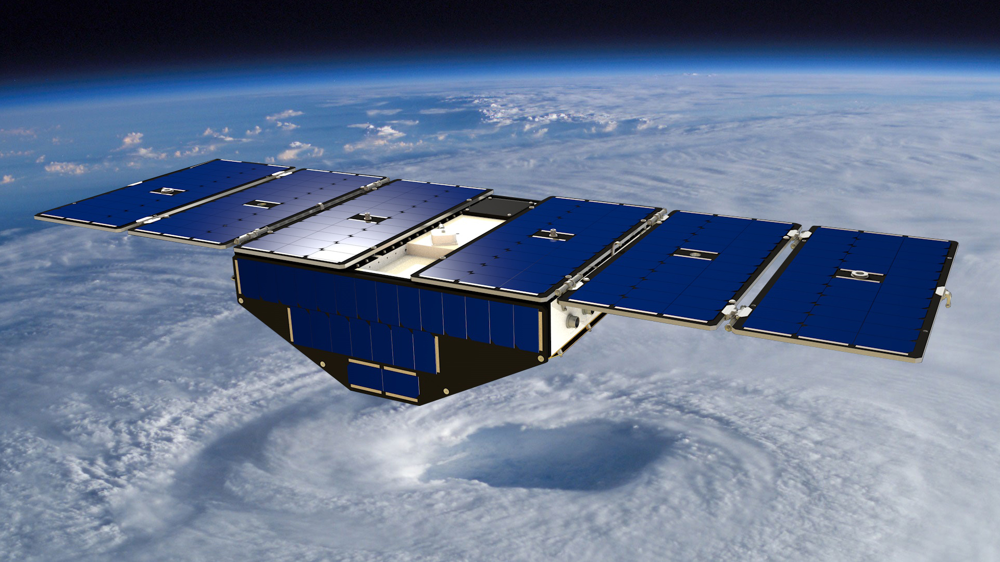
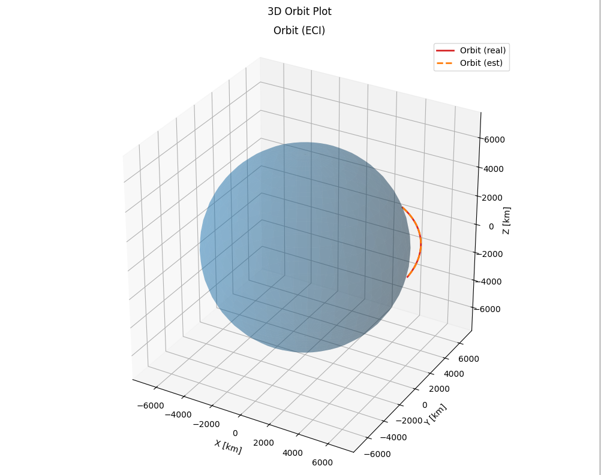

05: Orbit Estimation
====================

CubeSat missions often require precise orbit determination. In this tutorial, we will demonstrate the usage of an EKF orbit estimator with GPS measurements. 

For this example, we use the CYGNSS (Cyclone Global Navigation Satellite System) launched by the University of Michigan and the Southwest Research Institute in 2016.

.. list-table:: Simulation Configuration
   :widths: 25 75
   :header-rows: 1

   * - Component
     - Description
   * - **Sensors**
     - One GPS receiver, with a noise standard deviation of 5 km in position and 0.1 km/s in velocity for the real satellite
   * - **Satellite**
     - Mass of 28.9 kg, Inertia Matrix :math:`J_0 = diag([0.34, 0.27, 0.30]) \, kg \cdot m^{2}`.
   * - **Estimated Sensors**
     - One GPS receiver, with a noise standard deviation of 3 km in position and 0.1 km/s in velocity for the estimated satellite
   * - **Estimated Satellite**
     - Mass of 28.9 kg, Inertia Matrix :math:`J_0 = diag([0.34, 0.27, 0.30]) \, kg \cdot m^{2}`.
   * - **Orbit Estimator**
     - EKF (Extended Kalman Filter) with tuned initial covariance and process noise matrices.
   * - **Orbital State**
     - The initial position and velocity of the spacecraft in orbit.

.. code-block:: python

    import ADCS as ADCS
    import numpy as np
    import matplotlib.pyplot as plt

    gps_noise = ADCS.Noise(std_noise=np.array([5, 5, 5, 0.1, 0.1, 0.1]))  # km, km/s
    gps = [ADCS.GPS(noise=gps_noise)]
    gps_noise = ADCS.Noise(std_noise=np.array([3, 3, 3, 0.1, 0.1, 0.1]))  # km, km/s
    est_gps = [ADCS.GPS(noise=gps_noise)]

    satellite = ADCS.Satellite(mass=28.9, J_0=np.diag([0.34, 0.27, 0.30]), sensors=gps)
    est_satellite = ADCS.EstimatedSatellite(mass=28.9, J_0=np.diag([0.34, 0.27, 0.30]), sensors=est_gps)
    x_0 = np.array([0.00023, 0.0, 0.000065, 1, 0, 0, 0])

    os0 = ADCS.Orbital_State(ephem=ADCS.Ephemeris(),J2000=0.22, R=np.array([7000, 0, 0]), V=np.array([0, 7.5, 1]))
    est_os0 = ADCS.Orbital_State(ephem=ADCS.Ephemeris(),J2000=0.22, R=np.array([5000, 5, -5]), V=np.array([0.1, 4, 1.1]))

    P0 = np.diag([500**2.0, 500**2.0, 500**2.0, 0.5**2.0, 0.5**2.0, 0.5**2.0])    # initial covariance
    Q0 = np.diag([1, 1, 1, 10, 10, 10])

    orbit_estimator = ADCS.Orbit_EKF(est_sat=est_satellite, J2000=0.22, os_hat=os0, P_hat=P0, Q_hat=Q0, dt=20.0)

    results = ADCS.simulate(
        x=x_0,
        satellite=satellite,
        orbit_estimator=orbit_estimator,
        os0=os0,
        dt=20.0,
        tf=1000.0
    )

    from ADCS.helpers.plot import plot
    from ADCS.helpers.plot import OrbitPositionPlot, OrbitPositionPlotSingle, OrbitPositionPlotCombined

    plot(
        results,
        OrbitPositionPlot(sources=["real", "estimated"]),
        OrbitPositionPlotSingle(sources=["real", "estimated"], component="x"),
        OrbitPositionPlotCombined(sources=["real", "estimated"]),
        layout=(3,1),
        title="Orbit Position",
    )

    from ADCS.helpers.plot import OrbitVelocityPlot, OrbitVelocityPlotSingle, OrbitVelocityPlotCombined, OrbitPlot

    plot(
        results,
        OrbitVelocityPlot(sources=["real", "estimated"]),
        OrbitVelocityPlotSingle(sources=["real", "estimated"], component="x"),
        OrbitVelocityPlotCombined(sources=["real", "estimated"]),
        layout=(3,1),
        title="Orbit Velocity",
    )

    plot(
        results,
        OrbitPlot(sources=["real", "estimated"]),
        layout=(1,1),
        title="3D Orbit Plot",
    )

    plt.show()

The EKF is able to very accurately estimate the orbit of the satellite using noisy GPS measurements. GPS receivers have come so far that many CubeSat missions do not even require explicit orbit estimators, and just use raw GPS measurements.

.. list-table:: Simulation Results
   :widths: 50 50
   :header-rows: 0
   :class: borderless

   * - .. image:: ../_static/tutorials/tutorial_05_positionplot.png
          :width: 100%
     - .. image:: ../_static/tutorials/tutorial_05_velocityplot.png
          :width: 100%

