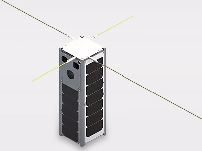

06: Trajectory Planner (Plan-and-Track)
=======================================

In this tutorial, we solve a challenging magnetic attitude-control problem for BeaverCube 1:
quick retargeting with only 3 magnetorquers (MTQs) and no reaction wheels.

The scenario uses the Plan-and-Track controller with trajectory optimization and TVLQR
tracking. This controller assumes high-fidelity field knowledge during planning, which can
improve accuracy for aggressive maneuvers.

A trajectory planner computes a feasible, optimized reference trajectory that the spacecraft
can track while satisfying actuator limits and pointing objectives.

For more details on related trajectory optimization methods, see
`SALTRO documentation website <https://nscheuer.github.io/SALTRO>`_.

.. list-table:: Simulation Configuration
   :widths: 25 75
   :header-rows: 1

   * - Component
     - Description
   * - **Satellite**
     - BeaverCube 1 generated from the built-in satellite factory.
   * - **Actuation**
     - 3 MTQ-only attitude control (underactuated, no reaction wheels).
   * - **Controller**
     - Plan-and-Track LQR with trajectory optimization settings and two solver passes.
   * - **Planner Costs**
     - Tuned angle and angular-rate weights for trajectory and TVLQR tracking.
   * - **Goals**
     - Piecewise inertial pointing timeline with target and no-goal intervals.
   * - **Orbit**
     - Circular-like LEO test orbit initialized from position and velocity vectors.

.. code-block:: python

    import os
    import sys
    sys.path.append(os.path.abspath(os.path.join(__file__, "../../..")))
    import ADCS as ADCS
    import numpy as np
    import matplotlib.pyplot as plt

    satellite = ADCS.satellite_factory.create_beavercube1_cubesat()

    x_0 = ADCS.State.from_array(np.array([0, 0, 0] + [1, 0, 0, 0])) # w, q, h

    planner_settings = ADCS.controller.plan_and_track.PlannerSettings(est_sat=satellite, bdot_on=0, dt_tp=50, dt_tvlqr=1.0)

    planner_settings.verbosity = False
    planner_settings.cost_main.use_full_cost_hessian = True
    planner_settings.pass1.regularization.use_dynamics_hess = 1
    planner_settings.init_traj.bdot_gain = 500
    planner_settings.pass1.aug_lag.penalty_init = 1e-3
    planner_settings.pass1.aug_lag.penalty_scale = 10
    planner_settings.pass1.convergence.max_outer_iter = 15
    planner_settings.pass1.convergence.max_inner_iter = 40
    planner_settings.pass2.aug_lag.penalty_init = 1e5
    planner_settings.pass2.aug_lag.penalty_scale = 10
    planner_settings.pass2.convergence.max_outer_iter = 8
    planner_settings.pass2.convergence.max_inner_iter = 20

    planner_settings.cost_main = ADCS.controller.plan_and_track.CostWeights(
            angle=1e1,
            angle_N=1e1,
            ang_vel=1e5,
            ang_vel_N=1e5,
            ang_vel_err_dir=1e2,
            ang_vel_err_dir_N=0.0,
            ang_vel_mag=0.0,
            ang_vel_mag_N=0.0,
            control_mult=1.0,
            ang_cost_func_type=2,
        )

    planner_settings.cost_second = planner_settings.cost_main

    planner_settings.cost_tvlqr = ADCS.controller.plan_and_track.CostWeights(
            angle=1e5,
            angle_N=1e6,
            ang_vel=1e6,
            ang_vel_N=1e8,
            ang_vel_mag=0.0,
            ang_vel_mag_N=0.0,
            control_mult=1.0,
            ang_cost_func_type=2,
        )

    controller = ADCS.controller.Plan_and_Track_LQR(est_sat=satellite, planner_settings=planner_settings)

    os0 = ADCS.Orbital_State(ephem=ADCS.Ephemeris(), J2000=0.22, R=np.array([5000, 0, 5000]), V=np.array([0, 7.5, 0]))
    goal_timeline = {0.0: ADCS.goals.ECI_Goal(np.array([1, 0, 0])), 300.0: ADCS.goals.No_Goal(), 400.0: ADCS.goals.ECI_Goal(np.array([0, 1, 0])), 700.0: ADCS.goals.No_Goal(), 800.0: ADCS.goals.ECI_Goal(np.array([0, 0, 1]))}
    goallist = ADCS.GoalList(goal_timeline=goal_timeline, time_units="seconds", start_juliantime=0.22)

    results = ADCS.simulate(
        x=x_0,
        satellite=satellite,
        controller=controller,
        goal=goallist,
        os0=os0,
        dt=1.0,
        tf=1000.0
    )

    ADCS.plot(
        results,
        ADCS.plots.AnimationPlot(),
        layout=(1,1),
        title="3+1 ALTRO Reduced",
    )

    ADCS.plot(
        results,
        ADCS.plots.AttitudePlot(sources=["real", "reference"]),
        layout=(1,1),
        title="3+0 ALTRO Mixed",
    )

    ADCS.plot(
        results,
        ADCS.plots.AngularVelocityPlotCombined(sources=["real"]),
        ADCS.plots.ControlPlotCombined(title="Magnetorquer Commands", units="Am²"),
        ADCS.plots.TargetHistogram(bin_width=5.0),
        ADCS.plots.TargetPlot(modes=["real_target"], title="Target Tracking"),
        layout=(2,2),
        title="3+0 ALTRO Mixed",
    )

    ADCS.plot(
        results,
        ADCS.plots.ControlPlotSingle(index=0, title="Magnetorquer 1", units="Am²"),
        ADCS.plots.ControlPlotSingle(index=1, title="Magnetorquer 2", units="Am²"),
        ADCS.plots.ControlPlotSingle(index=2, title="Magnetorquer 3", units="Am²"),
        layout=(3,1),
        title="3+0 ALTRO Mixed",
    )

    plt.show()

This Plan-and-Track setup is accurate but computationally heavier, which is expected for
an optimization-based controller with strong field knowledge assumptions.

Simulation Results
------------------

.. list-table:: Simulation Results
   :widths: 50 50
   :header-rows: 0
   :class: borderless

   * - .. image:: ../_static/tutorials/tutorial_06_planned_trajectory.png
          :width: 100%
     - .. image:: ../_static/tutorials/tutorial_06_tracked_trajectory.png
          :width: 100%

How To Run
----------

Install and build prerequisites:

- `docs/Install_Trajectory_Planner.md <../../Install_Trajectory_Planner.md>`_

Then run:

.. code-block:: bash

  python examples/tutorials/06_trajectory_planner.py
