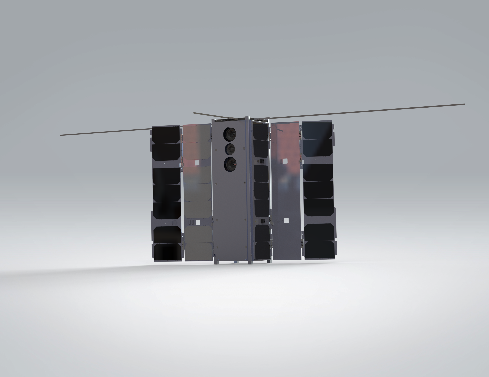

07: SALTRO Planner
==================

This tutorial uses `SALTRO <https://nscheuer.github.io/SALTRO>`_ on a BeaverCube 2 (3+1) pointing task aligned with Tutorial 06.
The control problem remains extremely difficult: 3 MTQ + 1 RW actuation with aggressive
retargeting requirements.

Compared with the Plan-and-Track trajectory planner, `SALTRO <https://nscheuer.github.io/SALTRO>`_ is typically much faster.
The tradeoff is that `SALTRO <https://nscheuer.github.io/SALTRO>`_ does not assume the same level of perfect field knowledge,
so you should expect differences in tracking quality depending on scenario and tuning.

A trajectory planner computes a feasible, optimized reference trajectory that the spacecraft
can track while satisfying actuator limits and pointing objectives.

For more details on `SALTRO <https://nscheuer.github.io/SALTRO>`_ methods, see the
`SALTRO documentation website <https://nscheuer.github.io/SALTRO>`_.

.. list-table:: Simulation Configuration
   :widths: 25 75
   :header-rows: 1

   * - Component
     - Description
   * - **Satellite**
     - BeaverCube 2 (3+1) generated from the built-in satellite factory.
   * - **Actuation**
     - 3 MTQ + 1 RW attitude control with aggressive magnetic-only retargeting constraints.
   * - **Controller**
     - `SALTRO <https://nscheuer.github.io/SALTRO>`_ planner/tracker with default
       SALTRO planner settings.
   * - **Goal Sequence**
     - Piecewise inertial goals with no-goal interval between retargeting segments.
   * - **Orbit**
     - Circular-like LEO test orbit initialized from position and velocity vectors.

.. code-block:: python

    import os
    import sys
    sys.path.append(os.path.abspath(os.path.join(__file__, "../../..")))
    import ADCS as ADCS
    import numpy as np
    import matplotlib.pyplot as plt

    satellite = ADCS.satellite_factory.create_beavercube2_cubesat()

    x_0 = ADCS.State.from_array(np.array([0, 0, 0] + [1, 0, 0, 0] + [0.0])) # w, q, h

    planner_settings = ADCS.controller.saltro.PlannerSettings(est_sat=satellite)
    controller = ADCS.controller.SALTRO(est_sat=satellite, planner_settings=planner_settings)

    os0 = ADCS.Orbital_State(ephem=ADCS.Ephemeris(), J2000=0.22, R=np.array([5000, 0, 5000]), V=np.array([0, 7.5, 0]))
    goal_timeline = {0.0: ADCS.goals.ECI_Goal(np.array([1, 0, 0])), 300.0: ADCS.goals.No_Goal(), 400.0: ADCS.goals.ECI_Goal(np.array([0, 1, 0])), 700.0: ADCS.goals.No_Goal(), 800.0: ADCS.goals.ECI_Goal(np.array([0, 0, 1]))}
    goallist = ADCS.GoalList(goal_timeline=goal_timeline, time_units="seconds", start_juliantime=0.22)

    results = ADCS.simulate(
        x=x_0,
        satellite=satellite,
        controller=controller,
        goal=goallist,
        os0=os0,
        dt=1.0,
        tf=1000.0
    )

    ADCS.plot(
        results,
        ADCS.plots.AnimationPlot(),
        layout=(1,1),
        title="3+1 SALTRO Reduced",
    )

    ADCS.plot(
        results,
        ADCS.plots.AttitudePlot(sources=["real", "reference"]),
        layout=(1,1),
        title="3+1 SALTRO Mixed",
    )

    ADCS.plot(
        results,
        ADCS.plots.AngularVelocityPlotCombined(sources=["real"]),
        ADCS.plots.ControlPlotCombined(title="Magnetorquer Commands", units="Am²"),
        ADCS.plots.TargetHistogram(bin_width=5.0),
        ADCS.plots.TargetPlot(modes=["real_target"], title="Target Tracking"),
        layout=(2,2),
        title="3+1 SALTRO Mixed",
    )

    ADCS.plot(
        results,
        ADCS.plots.ControlPlotSingle(index=0, title="Magnetorquer 1", units="Am²"),
        ADCS.plots.ControlPlotSingle(index=1, title="Magnetorquer 2", units="Am²"),
        ADCS.plots.ControlPlotSingle(index=2, title="Magnetorquer 3", units="Am²"),
        layout=(3,1),
        title="3+1 SALTRO Mixed",
    )

    plt.show()

In practice, `SALTRO <https://nscheuer.github.io/SALTRO>`_ provides a strong
speed-accuracy tradeoff for hard magnetic-only
pointing tasks and is often preferred when fast replanning is required.

Simulation Results
------------------

.. list-table:: Simulation Results
   :widths: 50 50
   :header-rows: 0
   :class: borderless

   * - .. image:: ../_static/tutorials/tutorial_07_planned_trajectory.png
          :width: 100%
     - .. image:: ../_static/tutorials/tutorial_07_tracked_trajectory.png
          :width: 100%

How To Run
----------

Install and build prerequisites:

- `docs/Install_Trajectory_Planner.md <../../Install_Trajectory_Planner.md>`_
- `docs/Install_SALTRO.md <../../Install_SALTRO.md>`_

If the `SALTRO <https://nscheuer.github.io/SALTRO>`_ folder is missing, clone recursively:

.. code-block:: bash

  git clone --recursive https://github.com/nscheuer/Generalized_ADCS.git

Then run:

.. code-block:: bash

  python examples/tutorials/07_SALTRO.py
