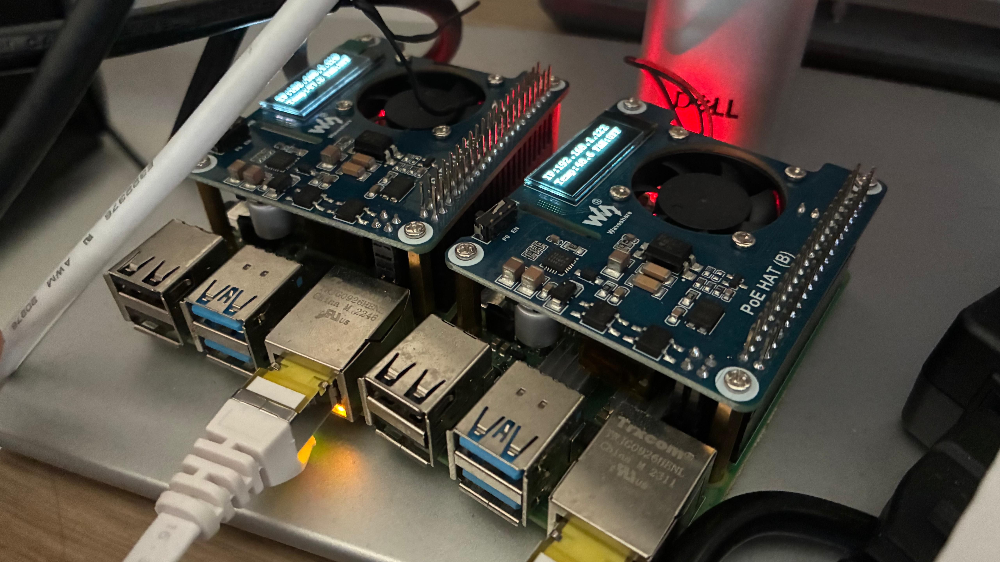
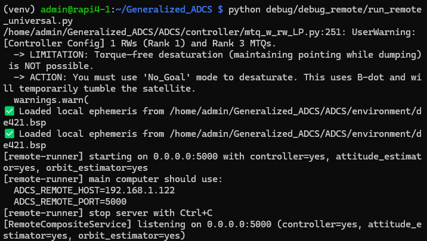
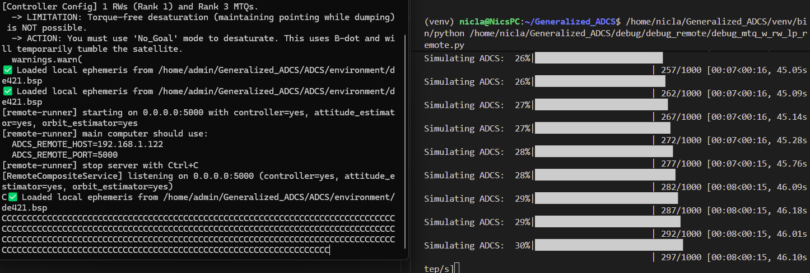
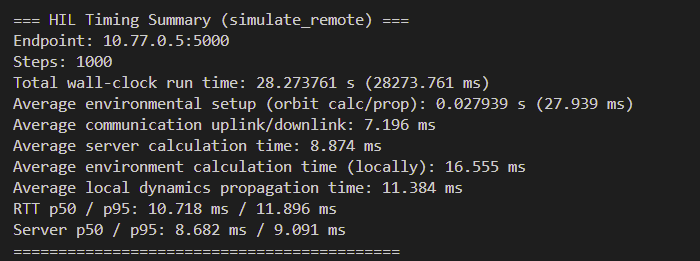
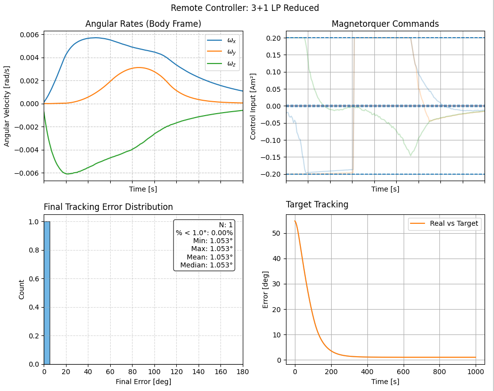

08: Remote Execution (Raspberry Pi + Main PC)
==============================================

This tutorial shows how to offload selected ADCS components to a remote computer
(such as a Raspberry Pi) while keeping environmental dynamics on the main PC.

Remote execution is useful when you want to emulate hardware-in-the-loop style
architectures, separate heavy compute from visualization workflows, or prototype
distributed ADCS pipelines before deployment.

Remote/Local Architecture
-------------------------

The simulation still uses one physical truth model. The main PC remains the owner
of environment and propagation (noise, bias, orbit propagation, attitude propagation,
and sensor generation from the local truth state). Remote components are queried over
XML-RPC when their outputs are needed.

You can choose where each component runs:

- Controller: :class:`~ADCS.controller.controller.Controller`
- Attitude estimator: :class:`~ADCS.estimators.attitude_estimators.attitude_estimator.Attitude_Estimator`
- Orbit estimator: :class:`~ADCS.estimators.orbit_estimators.orbit_estimator.Orbit_Estimator`

The server script used in this tutorial is
`run_remote_universal.py <https://github.com/nscheuer/Generalized_ADCS/blob/main/debug/debug_remote/run_remote_universal.py>`_.

.. list-table:: Remote Execution Configuration
   :widths: 25 75
   :header-rows: 1

   * - Component
     - Execution Location and Role
   * - **Environment and Dynamics**
     - Always local on the main PC in this tutorial. This includes disturbances,
       noise/bias realization, orbital state propagation, and rigid-body attitude propagation.
   * - **Controller**
     - Remote by default in the example script. The main PC sends state/context,
       and receives control commands from the remote server.
   * - **Attitude Estimator**
     - Optional remote component. Can be moved remote by setting
       ``RemoteSimulationConfig.estimator = ComponentLocation.REMOTE``.
   * - **Orbit Estimator**
     - Optional remote component. Can be moved remote by setting
       ``RemoteSimulationConfig.orbit_estimator = ComponentLocation.REMOTE``.
   * - **Transport**
     - XML-RPC over TCP using host/port configured by
       ``ADCS_REMOTE_HOST`` and ``ADCS_REMOTE_PORT``.

Networking Setup (Main PC + Raspberry Pi)
-----------------------------------------

1. Connect both devices to the same network (wired or Wi-Fi).
2. Ensure the Raspberry Pi firewall/router allows inbound connections to your chosen
   port (default in this tutorial: 5000).
3. Confirm connectivity from the main PC:

.. code-block:: bash

  ping <raspberry-pi-ip>

4. Clone the repository on Raspberry Pi (recursive clone recommended):

.. code-block:: bash

  git clone --recursive https://github.com/nscheuer/Generalized_ADCS.git
  cd Generalized_ADCS

5. Create/activate Python environment on Raspberry Pi and install dependencies.
   Use the same dependency setup flow as your main development machine.

Run Remote Server on Raspberry Pi
---------------------------------

Open a terminal on the Raspberry Pi and run:

.. code-block:: bash

  cd ~/Generalized_ADCS
  source venv/bin/activate
  python debug/debug_remote/run_remote_universal.py --host 0.0.0.0 --port 5000

Expected startup output should include the bind host/port and the values to export
on the main PC (for example, ``ADCS_REMOTE_HOST=<raspberry-pi-ip>``).

Run Client Simulation on Main PC
--------------------------------

On the main PC, use the IP printed by the Raspberry Pi terminal:

.. code-block:: bash

  cd ~/Generalized_ADCS
  source venv/bin/activate
  export ADCS_REMOTE_HOST=<raspberry-pi-ip>
  export ADCS_REMOTE_PORT=5000
  python examples/tutorials/08_remote_execution.py

This tutorial script is available at:
`examples/tutorials/08_remote_execution.py <https://github.com/nscheuer/Generalized_ADCS/blob/main/examples/tutorials/08_remote_execution.py>`_.

The script mirrors the remote debug workflow and defaults to controller-only remote
execution, while leaving environmental effects and propagation local.

.. code-block:: python

    import os
    import sys
    sys.path.append(os.path.abspath(os.path.join(__file__, "../../..")))
    import ADCS as ADCS
    import numpy as np
    import matplotlib.pyplot as plt

    np.random.seed(42)
    real_sat = ADCS.satellite_factory.create_beavercube2_cubesat(estimated=False)
    x_0 = np.array([0.0, 0.0, 0.0] + [1, 0, 0, 0] + [0.0])

    controller = ADCS.controller.MTQ_w_RW_LP(
        est_sat=real_sat,
        p_gain=0.00005,
        d_gain=0.002,
        c_gain=0.001,
        h_target=np.array([0.0, 0.0, 0.0]),
    )

    os0 = ADCS.Orbital_State(
        ephem=ADCS.Ephemeris(),
        J2000=0.22,
        R=7000 * np.array([0, np.sqrt(2) / 2, np.sqrt(2) / 2]),
        V=np.array([8, 0, 0]),
    )

    goal = ADCS.goals.ECI_Goal(eci_vector=ADCS.helpers.normalize(np.array([1.0, 1.0, 1.0])))

    remote_host = os.getenv("ADCS_REMOTE_HOST", "127.0.0.1")
    remote_port = int(os.getenv("ADCS_REMOTE_PORT", "5000"))

    results = ADCS.simulate_remote(
        x=x_0,
        satellite=real_sat,
        os0=os0,
        controller=controller,
        goal=goal,
        dt=1.0,
        tf=1000.0,
        remote=ADCS.remote.RemoteSimulationConfig(
            controller=ADCS.remote.ComponentLocation.REMOTE,
            estimator=ADCS.remote.ComponentLocation.LOCAL,
            orbit_estimator=ADCS.remote.ComponentLocation.LOCAL,
            host=remote_host,
            port=remote_port,
            timeout_s=0.5,
            retries=2,
        ),
    )

    ADCS.plot(
        results,
        ADCS.plots.AttitudePlot(sources=["real", "reference"]),
        layout=(1, 1),
        title="Tutorial 08: Remote Controller Execution",
    )

    ADCS.plot(
        results,
        ADCS.plots.AngularVelocityPlotCombined(sources=["real"]),
        ADCS.plots.ControlPlotCombined(title="Magnetorquer Commands", units="Am²"),
        ADCS.plots.TargetHistogram(bin_width=5.0),
        ADCS.plots.TargetPlot(modes=["real_target"], title="Target Tracking"),
        layout=(2, 2),
        title="Tutorial 08: Remote Controller Execution",
    )

    plt.show()

During execution, the Raspberry Pi terminal should show remote RPC activity while the
main PC terminal prints simulation progress and remote timing statistics.

Final timing statistics output on the main PC can be captured as documentation evidence.

Simulation Results
------------------

How To Shut Down
----------------

When finished, return to the Raspberry Pi terminal running the remote server and press
Ctrl+C. The server prints a shutdown message and exits cleanly.
